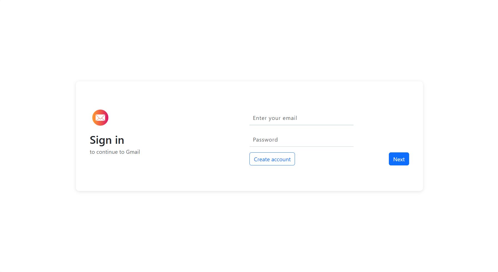
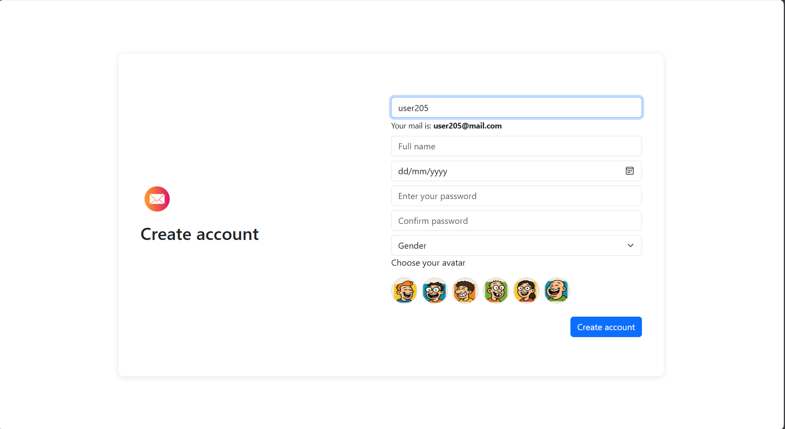
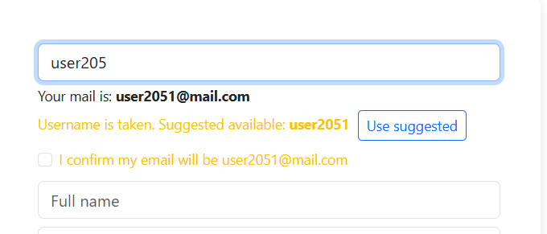
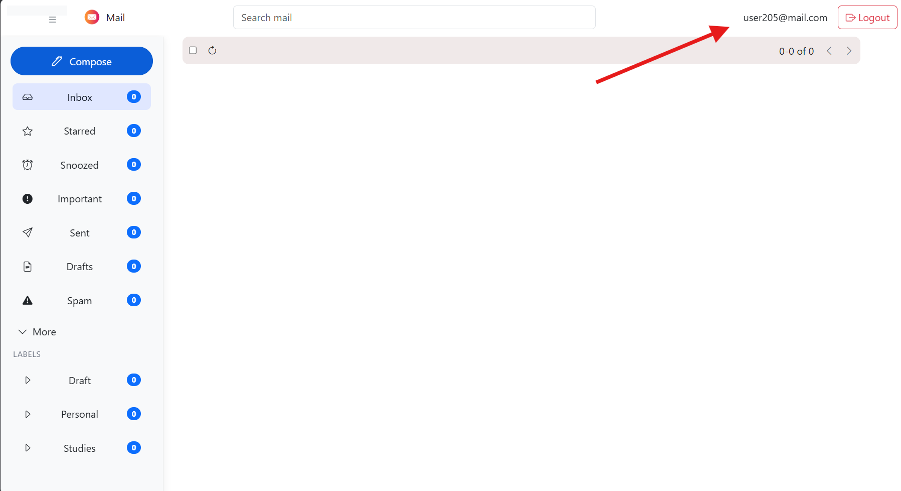
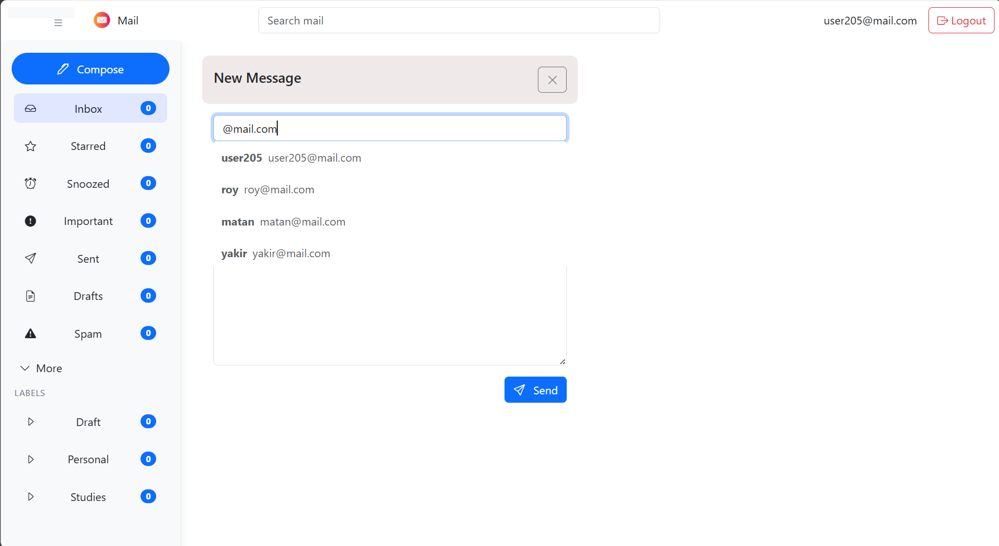
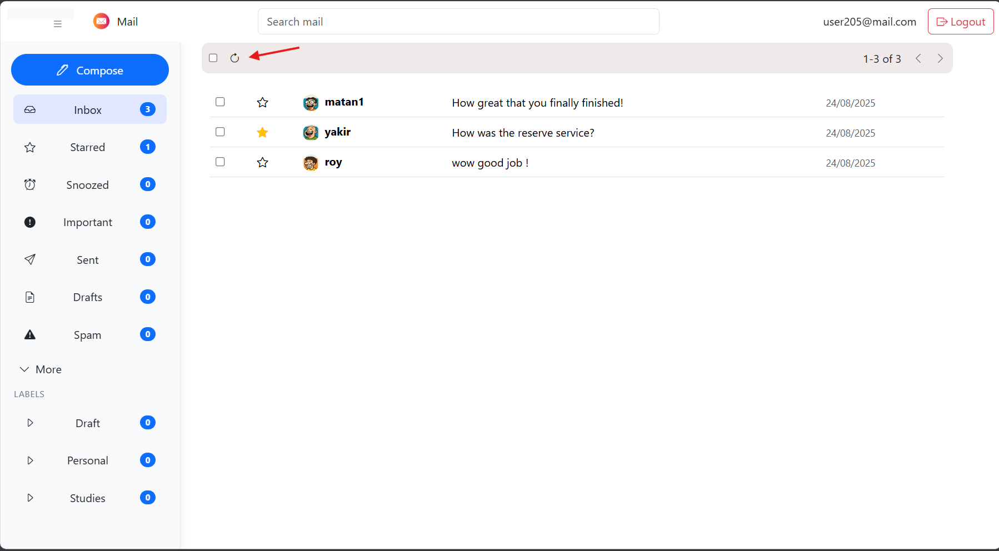
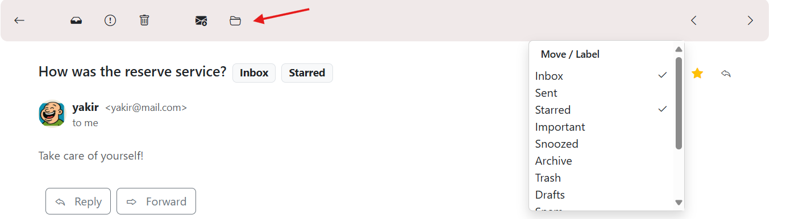

# Advanced Gmail

In this project, we create a Gmail-like website and email simulation system to learn various tools taught in the *Advanced Systems Programming* course.

---

## 🛠 Installation

### 1. Build the Docker image for the server and client

```bash
docker-compose build
```

This builds both:

* The C++ server (Gmail_server) located under server
* The Node.js client (Gmail_client) located under client

---

## 🚀 Running the Program

### Start the server and client:

```bash
docker-compose up -d server && docker-compose up -d client
```

## Features
- Login, Singup, Inbox, Sent, Starred, Archive, Trash
- Labels (create, assign, )
- Compose, Reply, Forward with suggestions
- Search and pagination

## Login



Navigate to `http://localhost:3001/login`.

- Enter your **email** and **password**.
- If you don’t have an account yet, click **Create account** to register first.
- Click **Next** to continue and sign in.


## Create Account



From the login screen, click **Create account** and complete the registration form:

- **Username** — choose a unique username.  
  The system will automatically generate your email address from it and display it beneath the field  
  (e.g., `user205` → `user205@mail.com`).
- **Full name**
- **Date of birth** (dd/mm/yyyy)
- **Password** and **Confirm password**
- **Gender**
- **Avatar** — pick one of the available avatars.

Click **Create account** to finish. Your new credentials can then be used to sign in.

### Username suggestion



If the chosen **username** is already taken, the app proposes an available alternative (e.g., `user2051`).  
Click **Use suggested** to apply it — the derived email address updates accordingly.


## Mailbox (Home)



After signing in, you land on your personal mailbox.

- Your **signed-in email address** is shown in the top-right corner — use it to verify which user is currently logged in.
- The **sidebar** provides quick access to Inbox, Starred, Snoozed, Important, Sent, Drafts, Spam, and custom **Labels**.
- Use the **search bar** at the top to find messages.
- The **toolbar** above the list supports selection, refresh, pagination.
- Message **counts** appear next to each label.

All functionality behaves like a standard email client (compose, reply, forward, labels, archive/trash, star, search ).


## Compose a Message



- Click **Compose** to open the new-message panel.
- In the **To** field, start typing to see **autocomplete** suggestions for users in the system (username + email).
- **Tip:** type `@` to list **all** users (every address contains `@`).
- Enter your message and click **Send**.
- A confirmation appears once the email is sent successfully.

## Inbox 



- After sending a message, click the **Refresh** icon in the inbox toolbar to fetch the latest emails.
- You can **star/unstar** a message directly from the Inbox list by clicking the star icon next to it.
- The **badge counters** (e.g., Inbox, Starred) update accordingly.


## Reading a Message — Toolbar & Labels



While viewing a message, use the toolbar at the top to manage it:

- **Archive** — move the message out of the Inbox and into Archive.
- **Delete** — move the message to Trash.
- **Mark as Important** — toggle the “Important” label.
- **Move / Label** — click the folder/menu button to open the label picker.  
  Choose any custom label to apply it immediately.
- **Star** — toggle the star from the header (or from the list view).

All changes are persisted and reflected in label counters.
 
### 🔐 Authentication Note
  
- All API requests (except registration and login) require a user-id header.
- Requests without a valid user-id will return 400 or 404 errors.
- 
- **Token-based auth (Bearer).**  
  The client authenticates by requesting a token and then attaching it to every API call.

- **Login**  
  `POST /api/tokens` with `{ email, password }`.  
  In the UI the field is labeled “Username”, but the frontend sends it as **email** to the API.

- **On success**  
  The app stores `token` and `userId` in `localStorage`. Subsequent requests automatically include  
  `Authorization: Bearer <token>` and `Content-Type: application/json`.

- **Auto sign-out on 401**  
  If the API returns **401 Unauthorized**, the client clears `token`/`userId` and redirects to `/login`.

- **Sign up**  
  `POST /api/users` with `{ username, password, name, avatarUrl }`.  
  The backend derives the email from the username (e.g., `alice` → `alice@mail.com`).

- **Logout**  
  Use the **Logout** button to clear credentials and return to the login screen.

- **Persistence**  
  You remain signed in across page reloads until you log out or the token expires.


## 📝 Notes
* User and email logic uses UUID for global uniqueness.

---

## ⚙️ Technologies Used

* C++ (server logic)
* Python 3 (TCP client)
* Node.js & Express (email API)
* Docker
* GoogleTest
* CMake
* React
* HTML + CSS
* Javascript

---

## 👤 Authors

* Roy Meiri (Scrum Master)
* Matan Badichi
* Yakir Sharabi

> Dev login page: `http://localhost:3001/login`
> Dev building + running 
```bash
docker-compose -f docker-compose.yml -f docker-compose.dev.yml up -d --build
```
