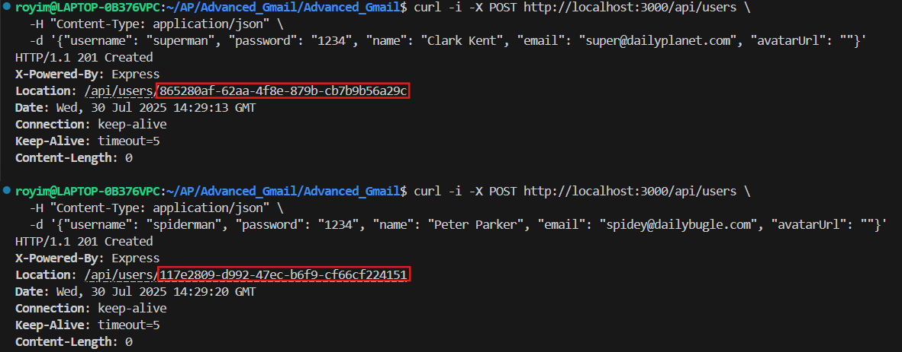
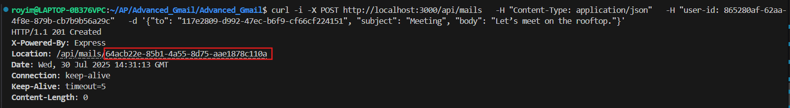

# Advanced Gmail

In this project, we create a Gmail-like website and email simulation system to learn various tools taught in the *Advanced Systems Programming* course.

---

## 🛠 Installation

### 1. Build the Docker image for the server and client

```bash
docker-compose build
```

This builds both:

* The C++ server (Gmail_server) located under server
* The Node.js client (Gmail_client) located under client

---

## 🚀 Running the Program

### Start the server and client:

```bash
docker-compose up -d server && docker-compose up -d client
```

This also initializes the Bloom Filter with:
CMD ["./runProgram", "5555", "8", "1", "2"]

---

## ⚙️ Usage

### Server behavior:

* The server waits for TCP connections and processes commands sent from the client.
* All communication is via newline-terminated strings.
* The client sends one command at a time and waits for the server's response before proceeding.

---

## 📧 Email Simulation

### API Endpoints

* `POST /api/users` – Register a user
* `GET /api/users/:id` – Get user data
* `POST /api/mails` – Send a mail
* `GET /api/mails` – Get inbox + sent mails
* `GET /api/mails/:id` – Get mail by ID
* `PATCH /api/mails/:id` – Update a sent mail
* `DELETE /api/mails/:id` – Delete mail from inbox/sent

---

## 💬 Example Scenario – Superman and Spiderman
📌 Important: Replace <SUPERMAN_ID>, <SPIDERMAN_ID>, and <MAIL_ID> with the actual UUIDs returned by the API.
Please avoid extra (or unnecessary) spaces
Please find attached examples

### Step 1 – Create Users:

```bash
curl -i -X POST http://localhost:3000/api/users \
  -H "Content-Type: application/json" \
  -d '{"username": "superman", "password": "1234", "name": "Clark Kent", "email": "super@dailyplanet.com", "avatarUrl": ""}'
```
```bash
curl -i -X POST http://localhost:3000/api/users \
  -H "Content-Type: application/json" \
  -d '{"username": "spiderman", "password": "1234", "name": "Peter Parker", "email": "spidey@dailybugle.com", "avatarUrl": ""}'
```
### How to find <SUPERMAN_ID>, <SPIDERMAN_ID>


### Step 2 – Send Mail (from Superman to Spiderman):

```bash
curl -i -X POST http://localhost:3000/api/mails \
  -H "Content-Type: application/json" \
  -H "user-id: <SUPERMAN_UUID>" \
  -d '{"to": "<SPIDERMAN_UUID>", "subject": "Meeting", "body": "Let’s meet on the rooftop."}'
```

### Step 3 – Check Spiderman's Inbox:

```bash
curl -i http://localhost:3000/api/mails \
  -H "user-id: <SPIDERMAN_UUID>"
```
### How to find <MAIL_ID>


### Step 4 – Update the Mail:

```bash
curl -i -X PATCH http://localhost:3000/api/mails/<MAIL_ID> \
  -H "Content-Type: application/json" \
  -H "user-id: <SUPERMAN_UUID>" \
  -d '{"subject": "Updated Meeting", "body": "Let’s meet at 8 PM."}'
```

### Step 5 – Delete the Mail:

```bash
curl -i -X DELETE http://localhost:3000/api/mails/<MAIL_ID> \
  -H "user-id: <SPIDERMAN_UUID>"
```

### 🔐 Authentication Note

* All API requests (except registration and login) require a user-id header.
* Requests without a valid user-id will return 400 or 404 errors.

## 📝 Notes
* Bloom Filter state is persisted between runs.
* User and email logic uses UUID for global uniqueness.
* Basic email simulation includes inbox, sent, search, and mail editing.

---

## ⚙️ Technologies Used

* C++ (server logic)
* Python 3 (TCP client)
* Node.js & Express (email API)
* Docker
* GoogleTest
* CMake

---

## 👤 Authors

* Roy Meiri (Scrum Master)
* Matan Badichi
* Yakir Sharabi
